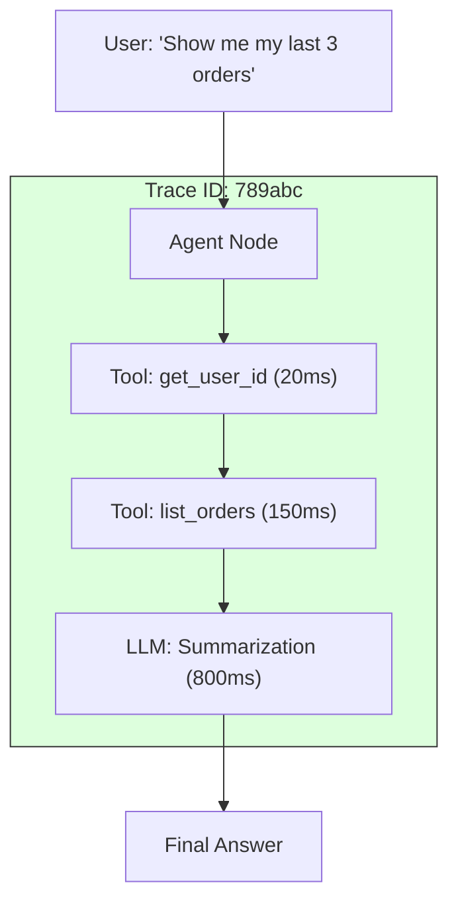

# 46. Observability & Tracing

> **Mentor note:** Debugging a standard app is easy: you look at the stack trace. Debugging an AI Agent is a nightmare: the logic is hidden inside a "black box" of weights. **Observability** and **Tracing** provide the "X-ray vision" you need. Tools like LangSmith or Langfuse allow you to see every tool call, every hidden prompt, and exactly how much each step cost in real-time.

---

## What You'll Learn

- Tracing vs. Logging: Why simple logs aren't enough for nested AI loops
- Spans and Generations: The anatomy of a complex agentic trace
- Online Evaluation: Automatically grading live production data using Judge models
- Feedback Loops: Collection of user "Thumbs Up/Down" for dataset curation
- Cost & Token Monitoring: Identifying expensive prompts in the wild

---

## Theory & Intuition

### The Visualization of a Chain

In a multi-agent or RAG system, one user question can trigger 5 tool calls and 3 LLM generations. A **Trace** links all these together so you can see exactly where the logic failed.



**Why it matters:** If the final answer is wrong, you can look at the trace and see: "Ah, the `list_orders` tool only returned 2 orders instead of 3." This turns a "vague AI problem" into a "fixable engineering problem."

---

## 💻 Code & Implementation

### Integrating Tracing (LangSmith Pattern)

This script demonstrates how to configure your environment for automated tracing of LLM applications.

```python
import os
from dotenv import load_dotenv

def setup_tracing():
    load_dotenv()
    
    # Global settings for LangChain/LangSmith
    os.environ["LANGSMITH_TRACING"] = "true"
    os.environ["LANGSMITH_API_KEY"] = os.getenv("LANGSMITH_KEY")
    os.environ["LANGSMITH_PROJECT"] = "Curriculum-Project-Refactor"

    print("Observability Layer Enabled.")
    print("Every LLM call will now be visible in the LangSmith dashboard.")
    print("-" * 50)
    print("Key metrics tracked:")
    print("1. Latency per step")
    print("2. Token count (Input/Output)")
    print("3. Full prompt/response history")
    print("-" * 50)

if __name__ == "__main__":
    setup_tracing()
```

---

## Observability Checklist

| Feature | What it catches | Production Role |
|---|---|---|
| **Latency Tracing** | Bottlenecks in the pipeline | User Experience |
| **Token Tracking** | Spikes in cost | Budget Management |
| **Input/Output Logs**| Hallucinations or logic errors | Quality Control |
| **PII Guarding** | Accidental data leakage | Compliance |
| **Feedback UI** | "Was this helpful?" signals | RLHF / Iteration |

---

## Interview Questions & Model Answers

**Q: Why don't we just use standard application logging for LLMs?**
> **Answer:** Standard logs are linear and flat. AI workflows are "nested" and "probabilistic." We need to see the **Chain of Thought** and the exact variables passed into a specific tool call three layers deep.

**Q: What is 'Dataset Curation' via observability?**
> **Answer:** It's the practice of looking at production traces where the user gave a "Thumbs Up" and saving those as "Gold Samples" for future fine-tuning or evaluation.

**Q: How do you handle privacy in AI tracing?**
> **Answer:** I implement a **Privacy Filter** at the SDK level to redact PII (Name, Email, IDs) before the trace is ever sent to the observability server.

---

## Quick Reference

| Term | Role |
|---|---|
| **Trace** | The full journey of a user request |
| **Span** | A single unit of work (e.g., one tool call) |
| **Metadata** | Extra info attached to a trace (e.g., user_type) |
| **Dataset** | A collection of traces used for testing |
| **A/B Testing** | Comparing two prompts using live traffic |
