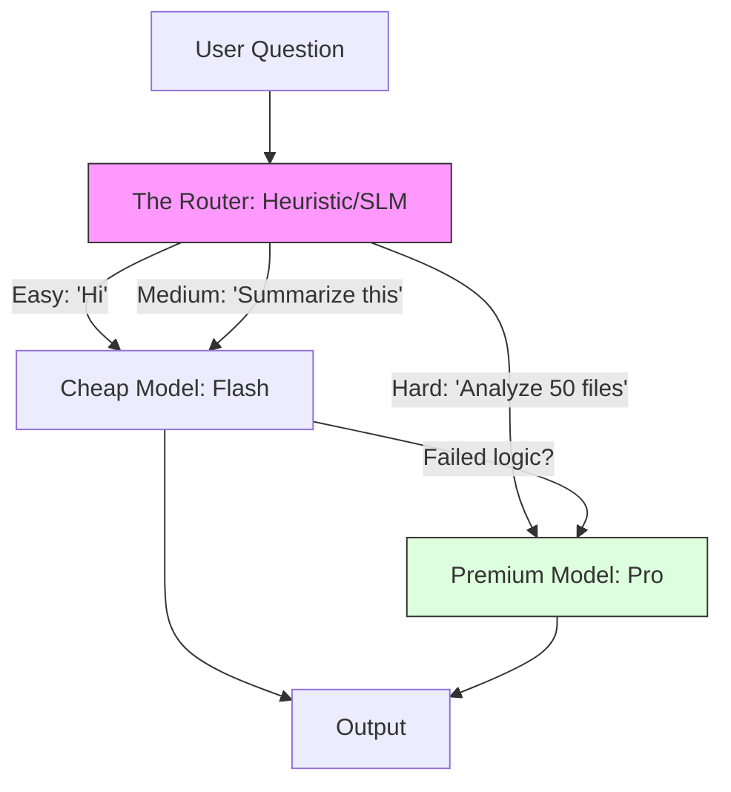

# 47. Cost Optimization & Model Routing

> **Mentor note:** Using GPT-4o or Gemini 1.5 Pro for every single request is like using a luxury car to pick up groceries 100 meters away. **Model Routing** is the strategy where you use a cheap, fast model (Flash) for 90% of tasks and "escalate" to a powerful model (Pro) only when the complexity is high.

---

## What You'll Learn

- The "Waterfall" Routing Strategy: From cheapest to most expensive
- Small Language Models (SLMs): Using Phi-3 and Llama-3-8B for routing
- Token Budgeting: Hard limits and monitoring per user
- Batch APIs: Getting 50% discounts for non-urgent tasks
- Prompt Compression: Removing redundant text to save input costs

---

## Theory & Intuition

### The Smart Router

Instead of hardcoding one model, you place a **Classifier** (or a very cheap SLM) in front. It analyzes the user query: "Is this a simple summary or a complex math proof?"



**Why it matters:** In most applications, 80% of queries are "Hello" or simple formatting tasks. Routing allows you to slash your API bill by **60-80%** without a significant drop in user-perceived quality.

---

## Cost-Efficiency Comparison

| Tier | Example | Relative Cost | Best For |
|---|---|---|---|
| **SLM (Edge)** | Phi-3, Gemma | $0 (Local) | PII masking, simple intent routing |
| **Small (Flash)**| Gemini Flash | $ (Cheap) | RAG, summarization, simple agents |
| **Premium (Pro)**| Gemini Pro | $$$ | Complex coding, long logic, judge |
| **Batch API** | Any via Batch | 50% Discount | Translation, data cleaning, logs |

---

## 💻 Code & Implementation

### A Basic Intent-Based Router

This script demonstrates how to route queries to different models based on complexity.

```python
def get_efficient_model(user_query: str):
    """
    Decides between a cheap model and a premium model.
    """
    complex_keywords = ["analyze", "code", "debug", "architect", "math"]
    
    # Simple heuristic-based router
    if any(k in user_query.lower() for k in complex_keywords):
        return "gemini-1.5-pro"  # Higher cost
    
    return "gemini-1.5-flash"   # Lower cost

def run_routing_demo():
    queries = [
        "Simplify this paragraph.",
        "Debug this complex race condition in my Go code."
    ]

    for q in queries:
        model = get_efficient_model(q)
        print(f"QUERY: '{q}'")
        print(f"ROUTED TO: {model}")
        print("-" * 30)

if __name__ == "__main__":
    run_routing_demo()
```

---

## Cost Control Strategies

1.  **Token Caps:** Implementing `max_output_tokens` to prevent the AI from generating useless long-form content.
2.  **Semantic Caching:** (Topic 45) Reusing answers for $0.
3.  **Prompt Compression:** Using a smaller model to "summarize" a long context before sending it to the expensive model.
4.  **Tiered Access:** Free users get Flash; Paid users get Pro.

---

## Interview Questions & Model Answers

**Q: In a RAG pipeline, how do you optimize costs for a massive document?**
> **Answer:** I use **Multi-Stage Summarization**. I use a cheap model (Flash) to extract key facts and create a dense summary. I then send only that summary to the expensive model for the final answer.

**Q: What is a 'Batch API' and when should you use it?**
> **Answer:** Batch APIs allow you to send a bulk of requests that are processed within 24 hours at ~50% cost. Use this for non-interactive tasks like overnight data cleaning.

**Q: Why use an SLM as a router?**
> **Answer:** SLMs like Phi-3 can be hosted on a single CPU for almost $0. Using them as a router allows you to "triage" queries locally before making an expensive cloud call.

---

## Quick Reference

| Term | Role |
|---|---|
| **Escalation** | Moving a hard task to a stronger model |
| **SLM** | Small Language Model (Gemma, Phi, Llama-3B) |
| **Batching** | Grouping requests for a volume discount |
| **Throughput** | How many tokens you can process per minute |
| **Rate Limit** | The ceiling on how much you can spend per minute |
