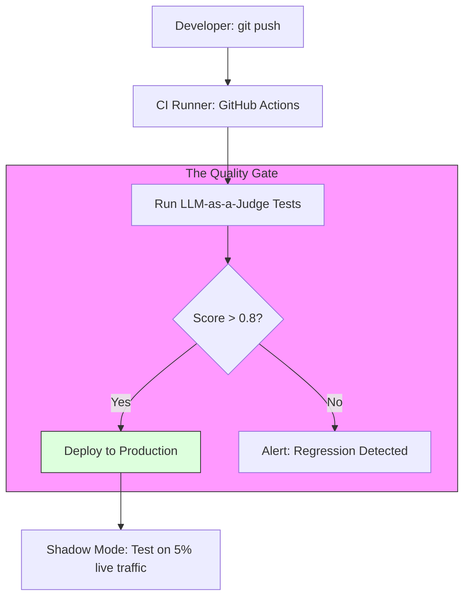

# 48. CI/CD for LLM Applications

> **Mentor note:** Standard software breaks when you change a line of code. AI software breaks when you change a single word in a prompt. **CI/CD for LLMs** is about automating the testing of your prompts and models. Every time you push code, an "Evaluation pipeline" should run 50 Judge-based tests to ensure your "better" prompt doesn't secretly break 20 other use-cases.

---

## What You'll Learn

- The Evaluation Pipeline: Automated grading on every Commit
- Regression Testing for Prompts: Preventing "Prompt Drift"
- A/B Testing & Canary Deploys: Safely rolling out new models
- Dataset Management: Versioning your "Golden Sets"
- Shadow Deployments: Running a new model in the background against live data

---

## Theory & Intuition

### The Continuous Evaluation Loop

Unlike traditional CI (where you check for syntax), AI CI checks for **Semantic Quality**. You run your new prompt against a "Golden Set" and check if the Judge's score remains high.



**Why it matters:** Safety. Without automated CI, you are just "guessing" if your prompt change is better. Automated evaluation gives you a mathematical "Quality Bar" that must be passed before any code touches the user.

---

## Deployment Strategies

| Strategy | How it works | Risk Level |
|---|---|---|
| **Direct Rollout** | Replace model immediately | High |
| **Canary** | Give 10% of users the new model | Low |
| **Shadow** | New model runs in parallel; result is hidden | **Zero** |
| **A/B Test** | Compare metrics (e.g., conversion) for both | Controlled |

---

## 💻 Code & Implementation

### A Basic Regression Test Script

This script simulates a CI gate that evaluates prompt quality against a predefined Golden Set.

```python
def run_regression_tests():
    # Golden Set: Inputs where we KNOW what the answer should look like
    golden_set = [
        {"input": "Hi", "expected": "Helpful Greeting"},
        {"input": "Reset my password", "expected": "Security Auth Link"}
    ]
    
    print("Starting CI Evaluation Pipeline...")
    
    for test in golden_set:
        # 1. Run the new prompt
        # response = call_llm(test['input'])
        
        # 2. Run the Judge to compare
        # score = judge_model(response, test['expected'])
        
        score = 0.95 # Simulated
        print(f"Test '{test['input']}': Score {score}")

    if score > 0.8:
        print("CI SUCCESS: Prompt quality maintained.")
    else:
        print("CI FAIL: Potential regression in response quality.")

if __name__ == "__main__":
    run_regression_tests()
```

---

## Interview Questions & Model Answers

**Q: What is 'Shadow Deployment' in LLMOps?**
> **Answer:** It's when you deploy a new model but don't show results to the user. Instead, the system sends every query to both the Live and Shadow model. We compare outputs using a Judge. If shadow performs better over 1,000 real requests, we promote it.

**Q: Why is 'Versioning' prompts as important as versioning code?**
> **Answer:** Because prompts dictate AI behavior. If the AI starts making mistakes after a change, you need a way to roll back. I store prompts in separate files in Git, not hardcoded in the logic.

**Q: How do you handle 'Non-Deterministic' tests in CI?**
> **Answer:** We don't use "Exact Match" tests. Instead, we use **Statistical Passing**. A test only fails if the Judge's average score across multiple runs drops below a threshold (e.g., 80%).

---

## Quick Reference

| Term | Role |
|---|---|
| **Golden Set** | The curated list of test cases that must always work |
| **Regression** | When a change makes an existing feature worse |
| **Judge** | The model that automates your CI testing |
| **Rollback** | Reverting to a previous model version |
| **Shadow Mode** | Parallel testing without user impact |
