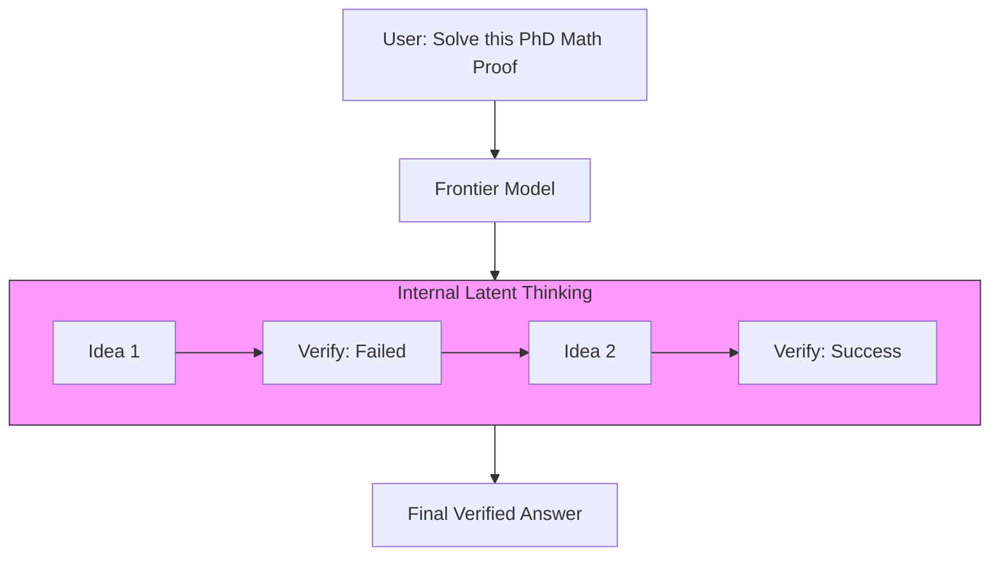

# 49. Frontier Models & Scaling Laws

> **Mentor note:** Why do AI companies spend billions on GPUs? Because of the **Scaling Laws**. These mathematical laws proved that if you increase the compute, the data, and the model size, the IQ of the model goes up in a predictable way.

---

## What You'll Learn

- The Chinchilla Scaling Laws: The optimal balance of Data vs. Parameters
- System 1 vs. System 2 Thinking: Impulsive vs. Deliberative reasoning
- "Scaling compute at Inference": The OpenAI o1 (Strawberry) breakthrough
- The "Data Wall": What happens when we run out of high-quality internet text?
- Future Architectures: Moving beyond the monolithic Transformer

---

## Theory & Intuition

### The Two Modes of Intelligence

Modern frontier models are evolving from "Instant Answers" (System 1) to "Deep Thinking" (System 2).
1.  **System 1 (Fast):** Predicting the next word immediately based on patterns.
2.  **System 2 (Slow):** Using "Chain of Thought" internally to verify logic before outputting a finalized answer.



**Why it matters:** In the past, scaling happened at "Training Time." In the future (o1 era), scaling happens at "Inference Time"—the AI spends more "Compute" (seconds) thinking about a specific answer to make it more accurate.

---

## The Components of Scaling

| Lever | Role | The Future |
|---|---|---|
| **Parameters** | The "Size" of the brain | Shrinking (High efficiency SLMs) |
| **Data (Tokens)**| The "Knowledge" library | Synthetic Data generation |
| **Inference Compute**| The "Time" spent thinking | Massive scaling for complex tasks |
| **Quality** | The "Purity" of training data| Expert-curated curriculum |

---

## 💻 Code & Implementation

### Simulating System 2 (Reasoning)

This script demonstrates how to force a model into a "deliberative" mode by requiring an internal monologue before the final answer.

```python
from google import genai

def simulate_system_2_thinking():
    client = genai.Client(api_key="YOUR_API_KEY")

    thought_prompt = """
    Solve this complex logic puzzle. 
    First, show your step-by-step thinking inside <thought> tags.
    Then, provide the final answer.
    
    PUZZLE: [Insert Complex Puzzle Here]
    """

    response = client.models.generate_content(
        model="gemini-1.5-pro",
        contents=thought_prompt
    )
    print(response.text)

if __name__ == "__main__":
    simulate_system_2_thinking()
```

---

## Interview Questions & Model Answers

**Q: What are the 'Scaling Laws' in LLMs?**
> **Answer:** These laws state that model performance (Perplexity) improves as a power law with the amount of **Compute**, **Dataset Size**, and **Parameter Count**.

**Q: What is the 'Chinchilla' optimal point?**
> **Answer:** Research found that for every 1 parameter in a model, you should train it on at least 20 tokens of data. This led to small but highly-trained models like Llama-3 (8B parameters, 15T tokens).

**Q: What is the 'Data Wall'?**
> **Answer:** It's the point where we run out of high-quality human-written text. The industry is shifting to **Synthetic Data**, where AI models generate data to train other models.

---

## Quick Reference

| Term | Role |
|---|---|
| **Synthetic Data** | High-quality text generated by AI for training |
| **System 2** | Deliberative, non-instant reasoning (Slow) |
| **GPU Cluster** | The physical hardware scaling the frontier |
| **Token-to-Param**| The 20:1 ratio for efficient training |
| **Emergent Ability**| A skill the AI learns only after reaching a certain size |
