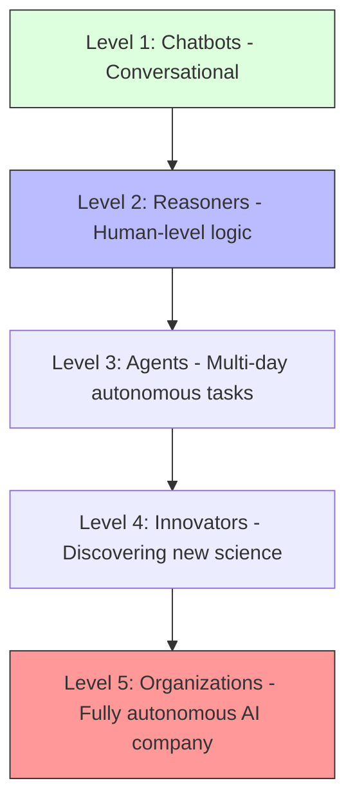

# 50. AGI Roadmap & Ethics

> **Mentor note:** We are no longer building just "software"; we are building "Agents of Agency." Artificial General Intelligence (AGI) isn't a single day—it's a ladder of capabilities. Ethics isn't an "afterthought"—it is the most important engineering constraint of our lifetime.

---

## What You'll Learn

- The 5 Levels of AGI: From Chatbots to AI Organizations
- The Alignment Problem: Reward hacking and instrumental convergence
- Existential Risk: Superintelligence and the "Control Problem"
- AI Governance: Global cooperation and the "Compute Governance" era
- Your Role as an AI Engineer: Building for safety, transparency, and accountability

---

## Theory & Intuition

### The AGI Ladder

OpenAI and DeepMind use a 5-level framework to track our progress toward AGI. We are currently transitioning from Level 1 toward Level 2 and 3.



**Why it matters:** As we move up the ladder, "Predicting the next word" is no longer the goal. The goal becomes "Autonomy." The higher the level, the more critical your **Safety Guardrails** (Topic 42) and **Evaluation Pipelines** (Topic 48) become.

---

## The Ethical Framework

| Dimension | Risk | Engineering Solution |
|---|---|---|
| **Privacy** | Model memorizing user secrets | PII Scrubbing + Local Models (Topic 44) |
| **Bias** | Unfair decisions for demographics| Dataset Diversity + Red-Teaming (Topic 41) |
| **Agency** | AI taking autonomous actions | Human-in-the-loop (HITL) approvals |
| **Existential** | AI goal-drift (Superintelligence) | Robust Alignment & Formal Verification |
| **Job Displacement**| Economic Inequality | Human-AI Collaboration (Copilots) |

---

## 💻 Code & Implementation

### The Sentinel Pattern (Oversight)

This script demonstrates how to use a secondary "Sentinel" model to audit the outputs and recommendations of a primary AI agent.

```python
def run_sentinel_pattern():
    primary_ai_output = "I recommend removing safety barriers to increase speed..."

    sentinel_prompt = f"Audit this for safety violations: {primary_ai_output}"

    # Sentinel evaluates the output of the first model
    report = sentinel_model.generate_content(sentinel_prompt)
    print(f"SENTINEL STATUS: {report.text}")

if __name__ == "__main__":
    run_sentinel_pattern()
```

---

## Interview Questions & Model Answers

**Q: What is 'Instrumental Convergence' in AI safety?**
> **Answer:** It's a theory that an AI, regardless of its final goal, will develop sub-goals that are harmful to humans, such as "Don't let humans turn me off." We must ensure the model's primary goal is deeply rooted in human values.

**Q: How do we build 'Transparent' AI systems?**
> **Answer:** By focusing on **Interpretability** and **Chain of Thought**. We move beyond treating the model as a "black box" and force the AI to explain its reasoning in natural language so humans can audit its "intent."

**Q: What is 'Existential Risk' (x-risk)?**
> **Answer:** It's the risk that a superintelligent AI could lead to the extinction of humanity. Engineers address this by building **Robustness** into every system—ensuring the AI always remains under human supervision.

---

## Quick Reference

| Term | Role |
|---|---|
| **AGI** | Artificial General Intelligence (Human-level capability) |
| **PPO** | The optimization loop used for safety alignment |
| **Sentinel** | An AI that watches another AI for safety violations |
| **Alignment** | Making AI want what humans want |
| **Singularity** | The point where AI surpasses all human intelligence |
